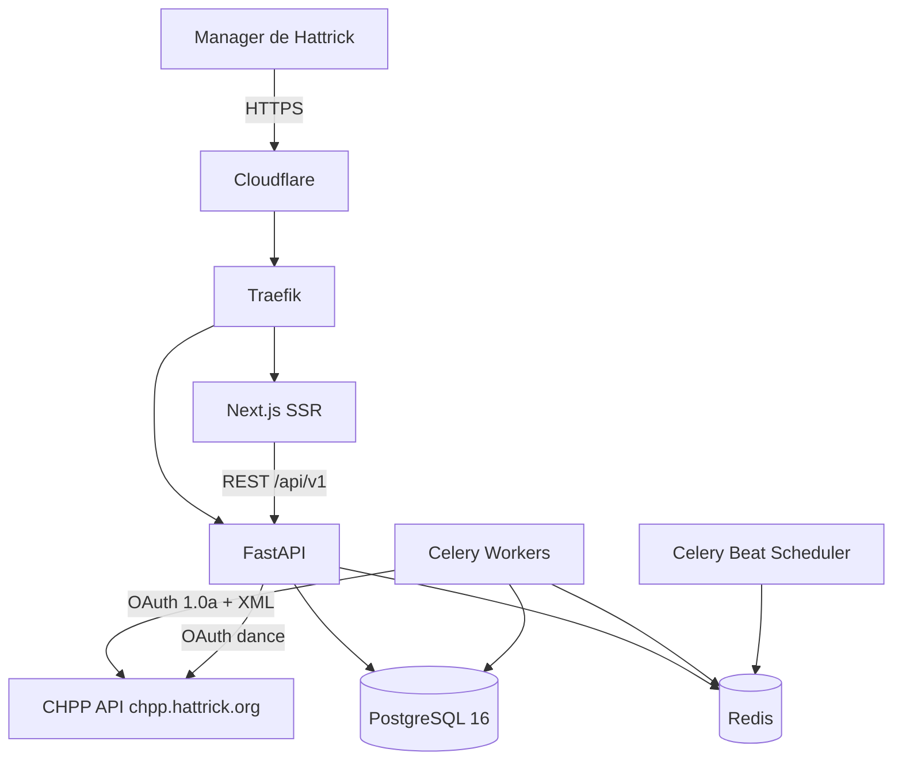

# 01 — Arquitectura del Sistema

## 1. Visión de arquitectura

Hattrick Lens es un SaaS multi-tenant con un backend Python (FastAPI) y un frontend Next.js. El backend sigue **Hexagonal Architecture (Ports & Adapters)**: el dominio (reglas de Hattrick, motores de cálculo) no conoce FastAPI, SQLAlchemy ni CHPP. Todo lo externo entra por adapters.

Principios rectores:

- **Dominio puro**: los motores (training, pricing, predicciones) son funciones/clases Python sin I/O → testeables al 100% y reutilizables por API, workers y AI Assistant.
- **Append-only**: nunca se sobrescribe información histórica; cada sync produce snapshots versionados (doc 02).
- **CQRS pragmático**: escritura vía use cases (sync, simulaciones persistidas); lectura vía *query services* optimizados que golpean vistas materializadas/read models. No event sourcing completo — coste injustificado.
- **Servicios desacoplados pero monorepo/monolito modular**: un solo deployable de API + workers Celery. Se extraen microservicios solo cuando una métrica lo exija (doc 13).

## 2. Diagrama de contexto (C4-1)



## 3. Contenedores (C4-2)

| Contenedor | Tecnología | Responsabilidad |
|---|---|---|
| `frontend` | Next.js (App Router, RSC) | UI, SSR, edge caching |
| `api` | FastAPI + Uvicorn | REST, auth, orquestación de use cases |
| `worker-sync` | Celery (cola `sync`) | Descarga y parsing CHPP, diffing, snapshots |
| `worker-compute` | Celery (cola `compute`) | Monte Carlo, forecasts, read models, agregados |
| `beat` | Celery Beat | Ventanas de sync elegibles, mantenimiento, refresh de vistas |
| `postgres` | PostgreSQL 16 + particionado nativo | OLTP + histórico |
| `redis` | Redis 7 | Cache, colas Celery, rate limiting, locks distribuidos |
| `traefik` | Traefik v3 | TLS, routing, middlewares de rate limit |

Separar `sync` y `compute` en colas distintas evita que una simulación de 10k iteraciones bloquee la ingesta de datos.

## 4. Arquitectura hexagonal del backend

```
backend/app/
├── domain/                    # NÚCLEO — cero dependencias externas
│   ├── entities/              # Player, Team, Match, TrainingWeek... (dataclasses puras)
│   ├── value_objects/         # Skill, SkillLevel, Money, Age(years,days), TSI
│   ├── services/              # Motores puros:
│   │   ├── training_engine.py     # velocidad, pops, cross-training
│   │   ├── pricing_engine.py      # valor esperado, over/underpriced
│   │   ├── prediction_engine.py   # ELO, Poisson, Bayes
│   │   ├── simulation_engine.py   # Monte Carlo temporada
│   │   ├── economy_engine.py      # forecast 52 semanas
│   │   └── rating_engine.py       # ratings de equipo/sector
│   ├── events/                # Domain events: PlayerSkillPopped, SyncCompleted...
│   └── ports/                 # Interfaces (Protocols):
│       ├── repositories.py    # PlayerRepository, TeamRepository...
│       ├── chpp_gateway.py    # CHPPGateway (fetch_team, fetch_players...)
│       ├── cache.py           # CachePort
│       └── clock.py           # Clock (testeabilidad temporal)
├── application/               # Casos de uso (orquestación, transacciones)
│   ├── commands/              # SyncTeam, ConnectCHPPAccount, RunSeasonSimulation
│   ├── queries/               # GetDashboard, GetPlayerTimeline, ComparePlayers
│   ├── dto/                   # Pydantic schemas de entrada/salida
│   └── unit_of_work.py        # UoW abstracto
├── infrastructure/            # ADAPTERS
│   ├── db/                    # SQLAlchemy models, UoW impl, repos impl
│   ├── chpp/                  # OAuth1 client, XML parsers por file type
│   ├── cache/                 # RedisCache
│   ├── events/                # Outbox → Redis pub/sub
│   └── telemetry/             # structlog, OpenTelemetry, Sentry
├── api/                       # Adapter HTTP
│   ├── v1/endpoints/          # routers por módulo
│   ├── deps.py                # DI vía Depends + contenedor
│   └── middleware/            # auth, rate limit, request-id
├── workers/                   # Adapter Celery
│   ├── celery_app.py
│   └── tasks/                 # sync_tasks, compute_tasks, maintenance
└── core/                      # config (pydantic-settings), container DI, logging
```

**Regla de dependencias** (validada en CI con `import-linter`): `domain` no importa nada de fuera; `application` solo importa `domain`; `infrastructure/api/workers` importan hacia dentro.

### Dependency Injection

Contenedor ligero (`dependency-injector` o wiring manual en `core/container.py`). Los use cases reciben ports por constructor. FastAPI resuelve por `Depends`, Celery por factory en el task. Esto permite: tests con fakes en memoria, swap de CHPP real por fixtures XML grabados.

### CQRS aplicado

- **Commands**: `SyncTeamCommand`, `RunTrainingSimulation`, etc. Pasan por UoW, emiten domain events al **outbox** (tabla `outbox_events`) que un worker publica → garantiza consistencia.
- **Queries**: leen de read models (`team_dashboard_rm`, vistas materializadas de agregados) sin pasar por el dominio. Un `DashboardQueryService` devuelve el dashboard en 1-2 queries.
- Los read models se reconstruyen a partir de snapshots — son desechables por diseño.

## 5. Flujo tipo: usuario abre el dashboard

1. Next.js RSC pide `GET /api/v1/teams/{id}/dashboard` con JWT.
2. FastAPI valida JWT, resuelve `DashboardQueryService`.
3. Cache Redis (`dash:{team_id}:{sync_version}`) — hit: responde <10 ms.
4. Miss: 1-2 SELECTs a read models; si el último sync es viejo, la respuesta incluye `stale: true` y el frontend ofrece "Sincronizar ahora" (requisito CHPP: descarga iniciada por el usuario).
5. El botón dispara `POST /sync` → encola `sync_team` en Celery → progreso vía SSE (`/sync/{job_id}/events`).
6. Al terminar el sync: outbox publica `SyncCompleted` → worker-compute recalcula read models → SSE notifica → React Query invalida y refetchea.

## 6. Decisiones de arquitectura (ADRs resumidos)

| # | Decisión | Alternativa rechazada | Razón |
|---|---|---|---|
| 1 | Monolito modular + workers | Microservicios desde día 1 | Equipo pequeño; hexagonal permite extraer después |
| 2 | Snapshots versionados append-only | Event sourcing puro | 90% del valor, 20% de la complejidad; CHPP ya entrega estado, no eventos |
| 3 | Celery + Redis | Arq/Dramatiq/RQ | Ecosistema, beat, colas múltiples, retries maduros |
| 4 | SSE para progreso | WebSockets | Unidireccional basta; más simple tras proxies/Cloudflare |
| 5 | PostgreSQL particionado | TimescaleDB | Suficiente hasta cientos de millones de filas; sin extensión extra (13) |
| 6 | REST v1, GraphQL después | GraphQL desde día 1 | OpenAPI + codegen de tipos TS da 90% del beneficio sin coste de gateway |
| 7 | Tokens CHPP cifrados en DB (Fernet, key en env/KMS) | Vault | Simplicidad operacional en fase 1; migrable |

## 7. Observabilidad

- **Logs**: structlog JSON con `request_id`, `user_id`, `team_id` propagados (contextvars) hasta los workers.
- **Métricas**: Prometheus (`/metrics`): latencia por endpoint, jobs por estado, llamadas CHPP/min, cache hit ratio.
- **Tracing**: OpenTelemetry (API → Celery → DB) exportado a Grafana Tempo.
- **Errores**: Sentry en frontend y backend, con release tracking desde CI.
- **Alertas**: fallos de sync >2% en 15 min, cola Celery >500 pendientes, p95 API >500 ms.
