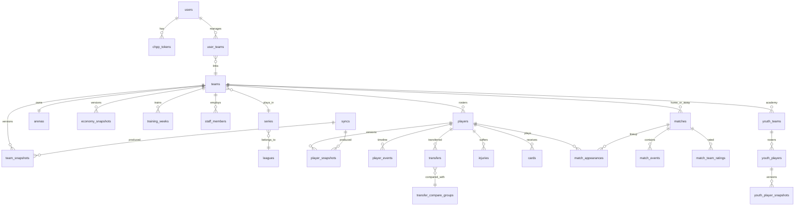

# 02 — Modelo de Datos

## 1. Principios

1. **Append-only para todo lo que evoluciona.** Cada entidad mutable de Hattrick tiene una tabla de identidad ("current") y una tabla de **snapshots** particionada por fecha. Nunca UPDATE destructivo sobre histórico.
2. **`sync_id` como unidad de versionado.** Todo snapshot referencia el sync que lo produjo → reproducibilidad total ("cómo se veía mi equipo el 3 de marzo").
3. **Diff-aware.** Se persiste snapshot completo solo si hubo cambio (hash comparado); si no, se registra `unchanged_since` → ahorra ~80% de filas en entidades estables.
4. **IDs de Hattrick como claves naturales** (`ht_player_id`, `ht_team_id`...) + PK surrogate `bigint generated always as identity`.
5. Enumeraciones de HT (skills 0-20+, specialties, tácticas) en tablas de referencia sembradas por migración, no hardcodeadas.

## 2. Diagrama ER (núcleo)



## 3. Tablas — inventario completo

### Identidad y acceso

| Tabla | Campos clave | Notas |
|---|---|---|
| `users` | id, email, password_hash (argon2), locale, tz, plan, created_at | Cuenta Hattrick Lens |
| `chpp_tokens` | id, user_id, oauth_token_enc, oauth_token_secret_enc, scope, ht_user_id, status, last_used_at | Cifrado Fernet; OAuth 1.0a no expira pero puede revocarse → status |
| `user_teams` | user_id, team_id, is_primary, role | Soporte multi-equipo (principal + secundarios HT) |
| `audit_log` | id, user_id, action, entity, entity_id, ip, ua, at | Append-only |

### Núcleo Hattrick — identidad

| Tabla | Campos clave |
|---|---|
| `leagues` | ht_league_id, name, country_code, season_offset |
| `series` | ht_series_id, league_id, division_level, name |
| `teams` | ht_team_id, name, short_name, series_id, founded_at, is_bot, logo_url |
| `national_teams` | ht_nt_id, league_id, type (senior/u21) |
| `players` | ht_player_id, team_id, first/last_name, birth_estimated_at, specialty_id, mother_club, first_seen_sync_id, left_team_at |
| `arenas` | ht_arena_id, team_id, name |
| `youth_teams` | ht_youth_team_id, team_id, name, created_at |
| `youth_players` | ht_youth_player_id, youth_team_id, names, specialty_id, promoted_player_id |
| `staff_members` | id, team_id, ht_staff_id, type (coach/assistant/doctor/psychologist/form_coach), level, hired_at, fired_at |

### Snapshots (particionadas por RANGE en `captured_at`, partición mensual)

| Tabla | Contenido versionado |
|---|---|
| `player_snapshots` | sync_id, player_id, age_years, age_days, tsi, form, stamina, experience, leadership, loyalty, salary, skills (keeper, defending, playmaking, winger, passing, scoring, set_pieces), htms, injury_level, cards, mother_club_bonus, is_transfer_listed, nt_caps, content_hash |
| `team_snapshots` | sync_id, team_id, spirit, confidence, fan_mood, fan_count, sponsors_mood, league_position, points, formation_xp (json), content_hash |
| `economy_snapshots` | sync_id, team_id, cash, board_reserves, income/cost breakdown (sponsors, gate, salaries, staff, youth, medical, interest, transfers), expected_weekly_delta |
| `arena_snapshots` | sync_id, arena_id, capacity (terraces/basic/roof/vip), avg_attendance, under_construction, expansion_cost |
| `training_weeks` | team_id, season, week, training_type, intensity, stamina_share, coach_level, assistant_levels (json), sync_id — 1 fila/semana, natural key (team, season, week) |
| `youth_player_snapshots` | sync_id, youth_player_id, age, skills+max (json: current, max, is_maxed), specialty, injury, cards |
| `series_standings_snapshots` | sync_id, series_id, team_ht_id, position, pts, gf, ga — para power ranking |

### Hechos inmutables (INSERT once)

| Tabla | Campos clave |
|---|---|
| `matches` | ht_match_id, type (league/cup/friendly/qualification), home/away_team_ht_id, date, status, venue_arena_id, crowd |
| `match_events` | match_id, minute, event_type_id, subject/object_player_ht_id, text |
| `match_team_ratings` | match_id, team_ht_id, midfield, rd/cd/ld, ra/ca/la, tactic_type, tactic_skill, possession_1st/2nd, attitude |
| `match_appearances` | match_id, player_ht_id, role_id, minutes, rating_stars, rating_stars_eom |
| `transfers` | ht_transfer_id, player_ht_id, seller/buyer_team_ht_id, price, deadline, tsi_at_sale, age_at_sale |
| `injuries` | player_id, level, started_at, healed_at (derivado de diffs) |
| `cards` | player_id, match_id, type, at |
| `player_events` | player_id, at, kind (transfer, injury, pop, promotion, nt_call...), payload jsonb — alimenta la Timeline |

### Derivadas / analytics

| Tabla | Propósito |
|---|---|
| `skill_pops` | player_id, skill, from_level, to_level, detected_at, training_week_ref — detectado por diff |
| `transfer_compare_groups` + `transfer_compare_samples` | Muestras de mercado por (skill bucket, edad, specialty) para pricing |
| `training_forecasts` | player_id, computed_at, horizon jsonb (skills proyectadas por semana) — cacheado, recomputable |
| `season_simulations` | team_id, params_hash, run_at, n_runs, p_promotion, p_relegation, p_champion, expected_points, position_distribution jsonb |
| `elo_ratings` | team_ht_id, at, elo — serie temporal |
| `outbox_events` | id, aggregate, event_type, payload, published_at |
| `syncs` | id, user_id, team_id, kind (full/partial/files[]), status, started/finished_at, files_fetched, bytes, error |

## 4. DDL representativo

```sql
CREATE TABLE player_snapshots (
    id              bigint GENERATED ALWAYS AS IDENTITY,
    sync_id         bigint NOT NULL REFERENCES syncs(id),
    player_id       bigint NOT NULL REFERENCES players(id),
    captured_at     timestamptz NOT NULL,
    age_years       smallint NOT NULL,
    age_days        smallint NOT NULL,
    tsi             integer NOT NULL,
    form            smallint NOT NULL,
    stamina         smallint NOT NULL,
    experience      smallint NOT NULL,
    salary          integer NOT NULL,
    keeper          smallint, defending smallint, playmaking smallint,
    winger          smallint, passing   smallint, scoring    smallint,
    set_pieces      smallint,
    injury_level    smallint NOT NULL DEFAULT -1,
    content_hash    bytea NOT NULL,          -- sha256 de campos relevantes → diffing
    PRIMARY KEY (id, captured_at)
) PARTITION BY RANGE (captured_at);

CREATE INDEX ix_ps_player_time ON player_snapshots (player_id, captured_at DESC);
CREATE INDEX ix_ps_hash ON player_snapshots (player_id, content_hash);
```

Particiones mensuales creadas por job de mantenimiento (`pg_partman` o task Celery). Detalle de estrategia de volumen en doc 13.

## 5. Patrón de escritura del sync (no sobrescribir jamás)

```
1. Parse XML → DTO normalizado
2. content_hash = sha256(campos_canónicos)
3. Si hash == último snapshot del player → sólo tocar syncs.files_fetched (no fila nueva)
4. Si difiere → INSERT snapshot + detectar deltas:
   - skill subió → INSERT skill_pops + player_events(kind='pop')
   - injury_level cambió → abrir/cerrar fila en injuries + evento
   - team_id cambió → cerrar players.left_team_at, evento 'transfer'
5. Todo dentro de una transacción por entidad-agregado; outbox event al final
```

## 6. Read models

- `mv_team_dashboard`: última foto agregada por equipo (fuerza, cash, spirit, lesiones activas, próximos partidos) — vista materializada refrescada al completar sync.
- `mv_player_current`: último snapshot por jugador (índice `DISTINCT ON`) — evita escanear particiones para vistas "actuales".
- `mv_training_progress`: pops por semana + velocidad estimada por jugador.
- Agregados de liga (`mv_series_power`): ratings medios por equipo para power ranking.
