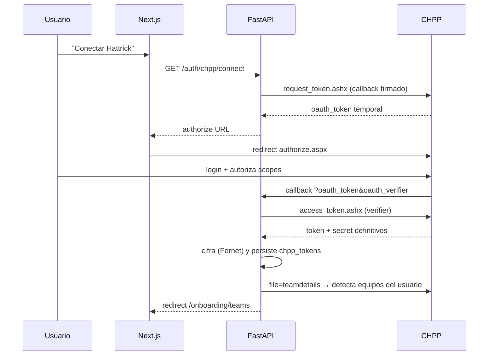

# 04 — Integración CHPP y Motor de Sincronización

## 1. OAuth 1.0a con CHPP

CHPP usa **OAuth 1.0a** (HMAC-SHA1, método GET). Endpoints oficiales:

- Request token: `https://chpp.hattrick.org/oauth/request_token.ashx` (siempre con `oauth_callback`)
- Authorize: `https://chpp.hattrick.org/oauth/authorize.aspx`
- Access token: `https://chpp.hattrick.org/oauth/access_token.ashx`
- Recursos: `https://chpp.hattrick.org/chppxml.ashx?file=<name>&version=<v>`

### Flujo



Notas de implementación:

- Cliente OAuth: `authlib` (OAuth1Session) con firma HMAC-SHA1.
- Los tokens CHPP **no expiran** por tiempo, pero el usuario puede revocarlos en HT → capturar 401, marcar `chpp_tokens.status='revoked'`, pedir re-auth. "Renovación automática" = re-lanzar el dance solo cuando falla, con aviso al usuario.
- Scopes CHPP (p.ej. `manage_challenges`, `set_matchorder`...) NO se solicitan: solo lectura por defecto → menor fricción de aprobación.
- User-Agent obligatorio: `HattrickLens/x.y.z`.
- Multi-equipo: `teamdetails` devuelve todos los equipos del usuario; se crean filas en `user_teams`.

## 2. Ficheros CHPP consumidos

| file | Entidades | Frecuencia útil | Prioridad |
|---|---|---|---|
| `teamdetails` | teams, series link, fan club | por sesión | P0 |
| `players` | roster + skills + salario | por sesión (cambia tras training/viernes) | P0 |
| `playerdetails` | detalle individual + historial NT | on-demand | P1 |
| `training` | config de entrenamiento actual | semanal | P0 |
| `trainingevents` (si disponible) | pops | semanal | P1 |
| `economy` | finanzas | semanal (día económico) | P0 |
| `arenadetails` | arena, capacidad | mensual / tras obras | P1 |
| `matches`, `matchdetails`, `matchlineup` | partidos, ratings, eventos, alineaciones | tras cada partido | P0 |
| `leaguedetails`, `leaguefixtures` | serie, tabla, calendario | semanal | P0 |
| `transfersplayer`, `transfersteam` | transferencias | on-demand | P1 |
| `youthteamdetails`, `youthplayerlist` | academia | semanal | P1 |
| `staffl​ist` | staff | mensual | P1 |
| `worlddetails` | ligas, fechas de temporada | mensual, global (no por usuario) | P2 |

Parsers: uno por file+version en `infrastructure/chpp/parsers/`, con XSD/fixtures de contrato versionadas. Ante campo desconocido → warning, nunca crash (HT cambia XMLs sin avisar).

## 3. Restricciones CHPP que gobiernan el diseño

1. **Descarga iniciada por el usuario** (manager assistants): prohibidos los timers. → El sync se dispara al abrir la app/pulsar "Sync". Se puede solicitar a HT excepción como statistics app para jobs nocturnos; hasta tenerla, **no hay cron de usuario**.
2. **Descargas secuenciales** por sesión: el pipeline baja files uno a uno (cadena Celery), nunca en paralelo para el mismo usuario.
3. **No espiar rivales**: no se almacena evolución de jugadores ajenos; de rivales solo datos de partido/tabla (permitido, 1 temporada). El módulo Liga se limita a ratings de partido + estadísticas públicas.
4. Solo XML — cero scraping HTML.

## 4. Motor de sincronización inteligente

### Disparadores

- **Session sync**: al login/apertura, si `last_sync > umbral` se ofrece sync con un clic (cumple "user-initiated").
- **Sync manual** por módulo (botón contextual: "actualizar economía").
- **Scheduled** (solo si HT concede la excepción): Celery Beat coloca ventanas elegibles; nunca antes de eventos conocidos (training update del viernes, día económico, post-partido) — el calendario HT por liga viene de `worlddetails`.

### Pipeline (cadena Celery, cola `sync`)

```
plan → fetch(file₁) → parse → diff → persist → … → fetch(fileₙ) → finalize
```

- **Planner**: decide qué files bajar según (a) prioridad, (b) `last_fetched` por file, (c) calendario HT (p.ej. no repetir `economy` si no pasó el día económico), (d) petición explícita del usuario. Produce un plan mínimo → menos llamadas, menos cuota.
- **Fetcher**: OAuth1 GET con retries (exponencial + jitter, máx 3), circuit breaker por host, timeout 15 s. Lock Redis `sync:{user_id}` impide sesiones paralelas.
- **Differ**: `content_hash` por entidad (doc 02). Solo persiste lo que cambió; emite deltas (pops, lesiones, traspasos) como domain events.
- **Finalizer**: marca `syncs.status`, refresca read models afectados, publica `SyncCompleted` → SSE al frontend.

### Frecuencias objetivo por entidad (cuando el usuario sincroniza)

| Entidad | Regla |
|---|---|
| Players/Training | siempre si `now > último training update` |
| Economy | solo si pasó el día económico de su liga |
| Matches | si hay partido finalizado sin `matchdetails` |
| Arena/Staff | si `last_fetched > 7 días` |
| League table | si hubo jornada |

### Rate limiting y cuotas

- Presupuesto por app (CHPP no publica límites duros): contador global Redis de llamadas/min con techo conservador configurable + token bucket por usuario (p.ej. 30 files/h).
- Backpressure: si el presupuesto global se agota, los syncs se encolan con prioridad (usuarios premium primero — palanca de monetización legítima).

## 5. Estrategia de caché (capas)

| Capa | Qué | TTL / invalidación |
|---|---|---|
| Redis: respuesta XML cruda | `chpp:{file}:{params_hash}` | TTL corto (5-15 min) — evita re-fetch en re-syncs accidentales |
| Redis: read models calientes | `dash:{team}:{sync_id}`, `roster:{team}:{sync_id}` | invalidación por clave al cambiar sync_id (nunca stale) |
| Redis: cálculos costosos | forecasts, valoraciones `val:{player}:{inputs_hash}` | TTL 24 h + invalidación por evento (pop, transfer) |
| PostgreSQL: vistas materializadas | agregados de liga/benchmark | REFRESH CONCURRENTLY post-sync o nocturno |
| HTTP: `ETag`/`Cache-Control` en GETs | payloads de dashboard/roster | ETag = sync_id → 304 baratos |
| Next.js: RSC + `staleTime` React Query | UI | staleTime 60 s; invalidate on SSE |

Claves versionadas por `sync_id` ⇒ no hay que "purgar", las claves viejas expiran solas.

## 6. Manejo de errores

- XML de error CHPP (file=error, chpp error codes) → excepciones tipadas (`CHPPAuthError`, `CHPPRateLimited`, `CHPPUnavailable`).
- Sync parcial: si falla el file 4 de 7, se persisten los 3 primeros, `syncs.status='partial'`, se reintenta solo lo faltante.
- Token revocado → email/notificación + banner de reconexión.
- Todos los XML crudos con error se archivan (S3/disco) 7 días para debugging de parsers.
